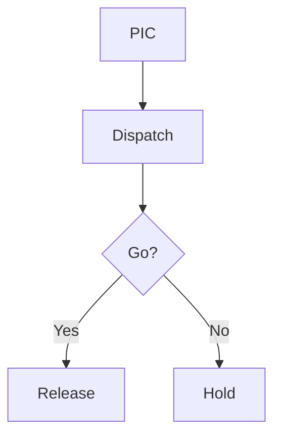

# Revdesk — Mermaid diagrams (lock)

Locked 2026-09-12. Procedure diagrams live in the leaf as **mermaid fences**. The source is the controlled text. The SVG is a render, same family as pagination: derived paper, not a second original.

Do not hand-roll ASCII boxes, paste a PNG, or keep a parallel `.svg` next to the section. An agent doing gap analysis reads the fence. A bitmap is a dead end.

## Fence

The only fenced block in the schema:

````markdown

````

Round-trips through parse → editor → serialize as that fence. `codeBlock` stays off. ` ```js ` and friends are not a node; they stay ordinary paragraph text.

Encouraged diagram kinds for ops manuals: `flowchart`, `sequenceDiagram`, `stateDiagram-v2`. Other mermaid types render if mermaid accepts them. Invalid source still **Writes**; paper shows a failure box, not a blank.

## Paper

Editor, Issued, and PDF all draw the same SVG. The fence is not printed as code.

- Toolbar **Diagram** inserts the starter flowchart above.
- Click the figure to edit the source (monospace). Preview updates live.
- Issued / print: figure only, no source, no “mermaid” kicker.
- `break-inside: avoid` so a diagram tries to stay on one page. Overflow still belongs to the page ledger.

PDF render: mermaid runs in the same Chromium pass as the book (`htmlToPdf`). No CDN. No network. Solo offline still prints.

## Gap analysis

`revdesk gap` is later (`deferred-kind-and-wip.md`). When it lands, it reads section Markdown, including mermaid fences. Do not replace a fence with an image to “make the PDF prettier.” That throws away the graph.

## Not this lock

Change bars on a diagram, mermaid in a table cell, generic code fences, exported PNG assets, a diagram library / reuse id, theming mermaid from `theme.yaml`.
